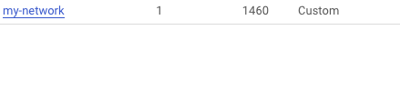
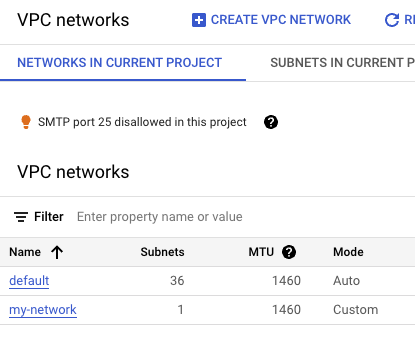
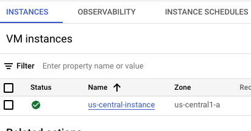
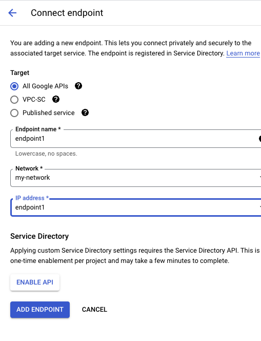
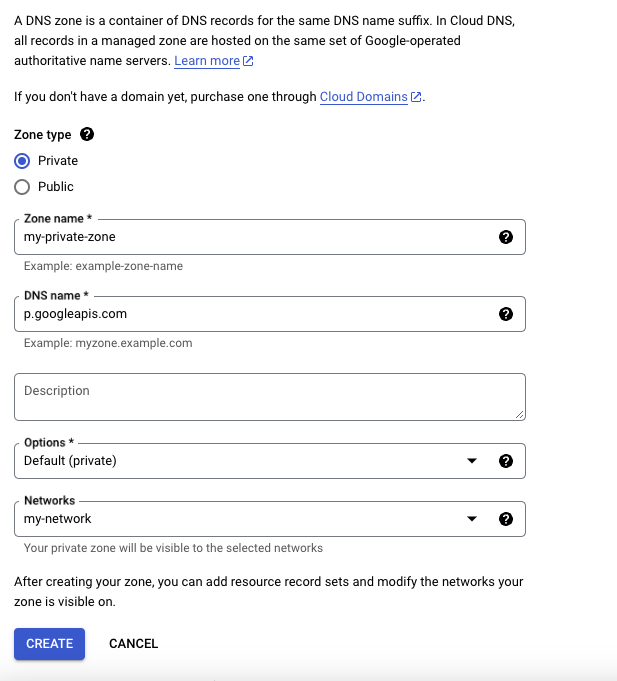
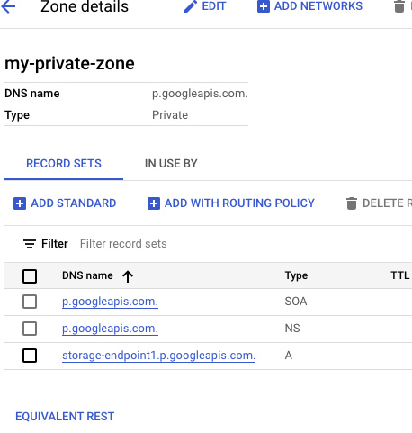
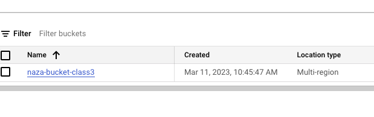

# Working on GCP private project

Steps:
Create new Project-> Private
Create VPC network-> Compute Engine API -> Enable
Create A VPC network -> name my-network -> name of the subnet us-central1-> pv4 range -> 10.1.0.0/16 -> Private google access-> On -> Create





Click on the Firewall on the VPC page > Create Firewall rule -> give the name ->  ingress-all -> Network -> my-network -> Targets -> All instances in the network -> Ipv4 ranges -> 0.0.0.0/0 -> Allow all for protocols and ports.

Compute engine in the search bar ->  Create instance -> give the name us-central-instance -> zone-> us-central-1-> Cloud API access scopes -> Allow full access to all Cloud APIs -> Advanced settings -> Networking-> select network my-network -> Create instance



Network services in More services -> Private Service Connect

Connect endpoint
name -> endpoint1 -> network -> my-network -> IP-address-> Create IP address -> name endpoint1 -> 10.99.0.2 -> Create



Cloud DNS -> Enable
Create Zone -> Zone type -> Private -> zone name -> my-private-zone -> DNS name -> p.googleapis.com -> network-> my-network -> Create



Add standard -> Create record set -> dns-name -> storage-endpoint1 -> IP -> 10.99.0.2 -> Create



Test -> go to Compute Engine ->  click SSH

```
gsutil mb gs://naza-bucket-class3
```

Following command allows to create the naza-bucket-class3 bucket



Then next step

```
curl -X GET -H "Authorization: Bearer $(gcloud auth print-access-token)" "https://storage.googleapis.com/storage/v1/b?project=$(gcloud config get-value project)"
```

I have the default setting in VPC my-network for all IPs 0.0.0.0/0 , so I can curl using following command

```
curl -X GET -H "Authorization: Bearer $(gcloud auth print-access-token)" "https://storage.googleapis.com/storage/v1/b?project=$(gcloud config get-value project)"
{
  "kind": "storage#buckets",
  "items": [
    {
      "kind": "storage#bucket",
      "selfLink": "https://www.googleapis.com/storage/v1/b/naza-bucket-class3",
      "id": "naza-bucket-class3",
      "name": "naza-bucket-class3",
      "projectNumber": "779954648275",
      "metageneration": "1",
      "location": "US",
      "storageClass": "STANDARD",
      "etag": "CAE=",
      "timeCreated": "2023-03-11T16:45:47.208Z",
      "updated": "2023-03-11T16:45:47.208Z",
      "iamConfiguration": {
        "bucketPolicyOnly": {
          "enabled": false
        },
        "uniformBucketLevelAccess": {
          "enabled": false
        },
        "publicAccessPrevention": "inherited"
      },
      "locationType": "multi-region",
      "rpo": "DEFAULT"
    }
  ]
}
```

So if I want to work more secure I can delete the default my-network routes, I only can curl to my storage-endpoint1

Curling the bucket information:

```
curl -X GET -H "Authorization: Bearer $(gcloud auth print-access-token)" "<https://storage-endpoint1.p.googleapis.com/storage/v1/b?project=$(gcloud> config get-value project)"
```

```
{
  "kind": "storage#buckets",
  "items": [
    {
      "kind": "storage#bucket",
      "selfLink": "https://www.googleapis.com/storage/v1/b/naza-bucket-class3",
      "id": "naza-bucket-class3",
      "name": "naza-bucket-class3",
      "projectNumber": "779954648275",
      "metageneration": "1",
      "location": "US",
      "storageClass": "STANDARD",
      "etag": "CAE=",
      "timeCreated": "2023-03-11T16:45:47.208Z",
      "updated": "2023-03-11T16:45:47.208Z",
      "iamConfiguration": {
        "bucketPolicyOnly": {
          "enabled": false
        },
        "uniformBucketLevelAccess": {
          "enabled": false
        },
        "publicAccessPrevention": "inherited"
      },
      "locationType": "multi-region",
      "rpo": "DEFAULT"
    }
  ]
}

```

Curl almost the same command as ping, can you reach the host, what exactly it shows us.

-X - what kind of request - Get

```

```

<https://storage-endpoint1.p.googleapis.com/storage/v1/b?project=$(gcloud> config get-value project)

```

Making command mor reusable
