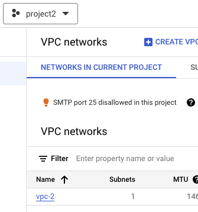
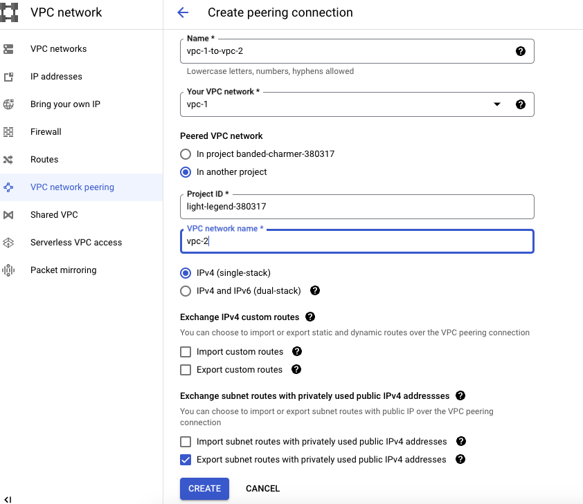
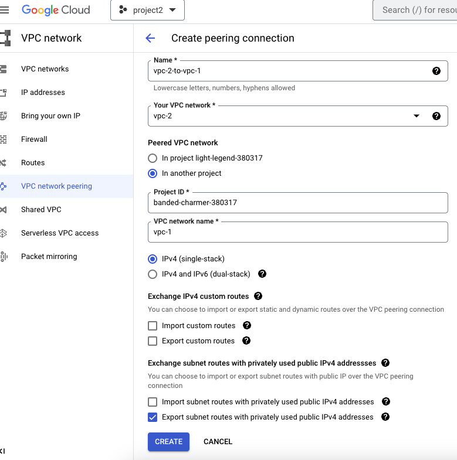
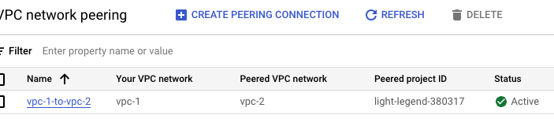
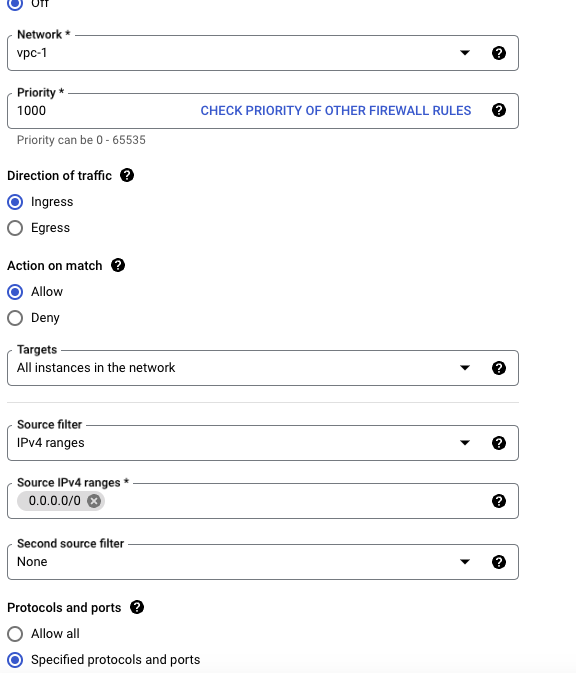
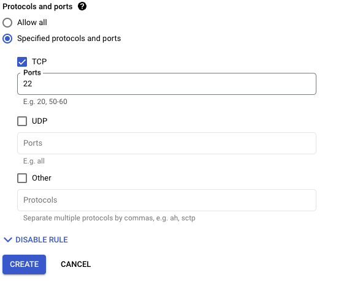
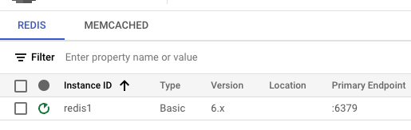
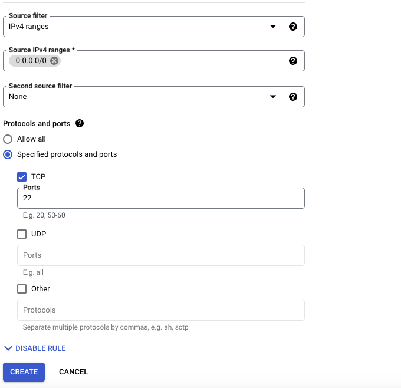

# VPC peering between two projects

For this purpose I created the 2 projects, project1 and project2.

In one time open two tabs, one for project1 and for project2, click to the VPC network in both of them -> Compute Engine API -> Enable

Delete default VPC networks on both projects

Create VPC for project1 -> name-vpc-1-> subnet-> subnet-1-> region -> us-central1-> Ipv4 range -> 10.1.0.0/16 -> Create.

The same for project2 -> vpc-2-> subnet-2-> us-central1 -> 10.2.0.0/16



Then start to create instances -> Compute Engine
Create instance -> vm-1 -> regin -> us-cental1 -> create it will connect to the vpc-1 network with 10.1.0.0/16 subnet
The same way for second instance for the project 2.
Create instance -> vm-2 -> regin -> us-cental1 -> create it will connect to the vpc-2 network with 10.2.0.0/16 subnet


For the connect two VPC
Click to the VPC network -> VPC network peering-> give it the name -> vpc-1-to-vpc-2 -> vpc network -> vpc-1 -> copy the project 2 iD -> add the name of project -> Create



For the project2 the same way
Click to the VPC network -> VPC network peering-> give it the name -> vpc-2-to-vpc-1 -> vpc network -> vpc-2 -> copy the project 1 ID -> add the name of project -> Create






Then Create Firewall on project1:
Name -> allow-ssh -> vpc-1-> target -> all instances in the network -> Source IPb4 ranges -> 0.0.0.0/0 -> Specified protocols and ports -> TCP -> 22 -> Create

Then create firewall rule for project 2 -> name-> ingress all- > IPv4 ranges -> 10.0.0.0/8 -> allow all -> Create

vm-1 - 10.1.0.2
vm -1 - 10.2.0.2 (10.0.0.0/8) Number of the first bits except 10, all three bits can change, if provide /16 - it only can change the last two digits.






Test the project1 -> Compute engine -> vm-1 -> SSH -> it can connect to the my vm

We have created VPC peering between vpc-1 to vpc -2 , and two vms can connect to each other, along with the correct firewalls, taking the cable plugin to one vm to another.

Then the next step:
Go to project2 -> Click to the Memorystore -> Google Cloud Memorystore for Redis API.

Create instance -> instance ID -redis -> Tier Selection -> Basic -> leave default -> network -> vpc-2 -> Create instance.




For ssh create firewall instance for project2, which we did earlier for project1




To connect redis-> have to use redis cli -> ssh to vm2 ->

```
sudo apt-get install redis-tools
redis-cli -h primary endpoint without port
set mykey value
get mykey
"value"
```

For the next testing I go to the terminal of my vm-1:

```
sudo apt install redis-tools -y
```

But VPC peering didn't give the chance to connect to the redis from vpc1 -> because vpc-1 and redis is not peered.

Solution: Create the proxy
 project2 -> Compute engine-> name -> redis-proxy -> choose the region -> us-central1 -> create
ssh to redis-proxy 
Get use the running apt update command

```
sudo apt update
sudo apt install nutcracker -y
sudo vi nutcracker.yaml
redis-1:
 listen: 0.0.0.0:6379
 redis: true
 servers:
 - [REDIS-1 IP]:6379:1
```
Nutcracker package that allows to manage proxy
Anything can talk with redis 
Within the [REDIS-1] paste the endpoint of the redis

```
sudo nutcracker --conf-file nutcracker.yaml
```
Proxy is running in the environment on the backend, we will never see.


For connecting to the redis:

```
redis-cli -h 10.2.0.3 
```
Now , vm1 connected to the redis database
Vm1 can talk to redis database server using the nutcracker package.

Make sure that in nutcracker.yaml have following commands:

```
redis-1:
 listen: 0.0.0.0:6379
 redis: true
 servers:
 - 10.136.104.243:6379:1
 ```

Proxy -> number of Nurjamal-> but I don't have the number of Nursultan -> so proxy in this case is Nurjamal -> connector she can call Nursultan to have a conference call, so i can have the connection with Nursultan, same thing with vms.

Basically can do VPC peering without doing the VPC peering through the Proxy. 

